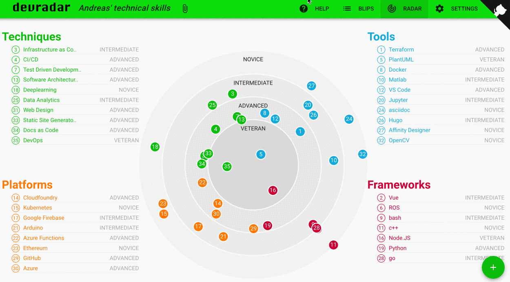

# devradar

> Visit [devradar.io](https://devradar.io) for an introduction

This repository holds the individual projects making up the devradar ecosystem:

* [editor](editor/): track and visualize tech skills (Vue)
* [teams](teams/): manage skills across an entire team (Vue)
* [web](web/): devradar landing page at [devradar.io](//devradar.io) (Hugo)

See [anoff/devradar-static](https://github.com/anoff/devradar-static) for a easy to setup version of the devradar to present your own tech skills.

## Demo

### devradar editor

## License & Attributions

Copyright 2019 Andreas Offenhaeuser <https://anoff.io>

All devradar code is licensed under [MIT](LICENSE) see [tl;dr; legal](https://tldrlegal.com/license/mit-license) for a quick overview of what this means.

