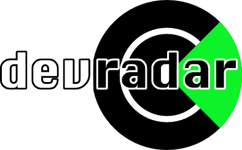

  
   
  Track and manage skills as an individual and manage competencies across a team.

# ⚠️ Abandoned

Even though I love the project I currently do not have time to work on it.
Most dependencies are outdated since over a year and I have not taken care of any issues.
There are a lot of bad design flaws in this Vue application that make it difficult to maintain.

## License & Attributions

Copyright 2019 - 2023 Andreas Offenhaeuser <https://anoff.io>

This code is licensed under [MIT](LICENSE) see [tl;dr; legal](https://tldrlegal.com/license/mit-license) for a quick overview of what this means.

