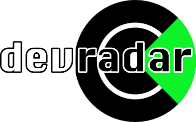
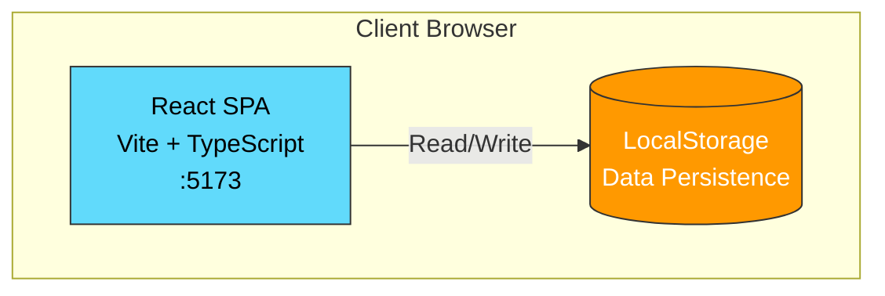

# DevRadar

<p align="center">
  
  <br>
  Track and present your skills as a developer.
  <br>
  A local-first SPA for skill tracking and journaling.
</p>

[](LICENSE)
[](https://www.typescriptlang.org/)
[](https://react.dev/)
[](https://vitejs.dev/)

DevRadar is a frontend-only Single Page Application (SPA) for tracking and managing your development skills and activities. All data is stored locally in your browser's LocalStorage, ensuring your information remains private and accessible offline.

## 🏗️ Architecture


```mermaid
graph TB
  subgraph "Client Browser"
      FE[React SPA<br/>Vite + TypeScript<br/>:5173]
      LS[(LocalStorage<br/>Data Persistence)]
  end

  FE -->|Read/Write| LS

  style FE fill:#61dafb,stroke:#333,color:#000
  style LS fill:#ff9900,stroke:#333,color:#fff
```

This is a **local-first, frontend-only Single Page Application** with no backend. All data is stored locally in the browser's LocalStorage.

## 🚀 Tech Stack

- **Framework:** React 19+ with TypeScript
- **Build Tool:** Vite
- **Styling:** Tailwind CSS v4 + Shadcn UI + SCSS Modules
- **State Management:** Zustand & React Hooks
- **Routing:** React Router 7
- **Data Storage:** Browser LocalStorage
- **Icons:** Lucide React

## 🎯 Features

- **Skill Tracking:** Add, manage, and track your development skills with proficiency levels
- **Skill Journal:** Log daily activities and associate them with specific skills
- **Progress Analytics:** Visualize skill development and track progress over time
- **Local-First:** No backend, no cloud, no accounts. All data stays on your device
- **Data Portability:** Export and import your data as JSON for backup and portability
- **Offline Ready:** Works completely offline since there's no server dependency

## 🛠️ Development Setup

### Option 1: Using VS Code Dev Container (Recommended)

This project includes a Dev Container configuration for a consistent development environment.

**Prerequisites:**

- [Docker Desktop](https://www.docker.com/products/docker-desktop/) (Running)
- [VS Code](https://code.visualstudio.com/)
- [Remote - Containers Extension](https://marketplace.visualstudio.com/items?itemName=ms-vscode-remote.remote-containers)

**Quick Start:**

1. **Clone the repo:**

   ```bash
   git clone https://github.com/devradar/devradar.git
   cd devradar
   ```

2. **Open in Container:**
   - Open folder in VS Code
   - Click "Reopen in Container" when prompted
   - Or: `Ctrl/Cmd+Shift+P` → "Dev Containers: Reopen in Container"

3. **Start development:**

   ```bash
   task dev
   ```

4. **Open in browser:**
   - Navigate to `http://localhost:5173`

### Option 2: Local Development

**Prerequisites:**

- Node.js 20+ (LTS recommended)
- npm or pnpm

**Quick Start:**

1. **Navigate to the web directory:**

   ```bash
   cd web
   ```

2. **Install dependencies:**

   ```bash
   npm install
   ```

3. **Run the development server:**

   ```bash
   npm run dev
   ```

4. **Open in browser:**
   - Navigate to `http://localhost:5173`

## 📋 Available Commands

We use [Task](https://taskfile.dev/) to automate development tasks. All commands can be run from the project root.

| Command        | Description                                |
| :------------- | :----------------------------------------- |
| `task dev`     | Starts the Vite development server (:5173) |
| `task build`   | Creates production build in `web/dist`     |
| `task preview` | Preview production build locally           |
| `task clean`   | Remove build artifacts and node_modules    |

## 🗂️ Project Structure

```
devradar/
├── web/                    # React application
│   ├── src/
│   │   ├── App.tsx        # Main app component
│   │   ├── main.tsx       # Entry point
│   │   ├── assets/        # Static assets
│   │   └── styles/        # Global styles
│   ├── public/            # Public assets
│   ├── index.html         # HTML template
│   ├── vite.config.ts     # Vite configuration
│   └── package.json       # Frontend dependencies
├── assets/                # Project assets (logo, etc.)
├── .devcontainer/         # VS Code Dev Container config
├── Taskfile.yml          # Task automation config
└── README.md             # This file
```

## 💾 Data Storage

All application data is stored in the browser's LocalStorage. This means:

- ✅ **No server required** - Works completely offline
- ✅ **Private** - Your data never leaves your device
- ✅ **Fast** - Instant read/write operations
- ⚠️ **Browser-specific** - Data is tied to the browser on this device
- ⚠️ **Limited storage** - Typically 5-10MB per domain
- ⚠️ **Can be cleared** - Clearing browser data will delete app data

### Data Persistence Best Practices

To avoid data loss:

1. **Export Regularly:** Use the built-in export feature to download your data as JSON
2. **Import on New Devices:** Import your JSON file to restore data on other devices/browsers
3. **Backup:** Keep periodic backups of your exported JSON files

## 🚀 Building for Production

### Build Static Assets

```bash
task build
# or
cd web && npm run build
```

This creates an optimized production build in `web/dist/`.

### Deploy Options

Since this is a static SPA, you can deploy to any static hosting service:

- **[Vercel](https://vercel.com/)** - Zero-config deployment for Vite apps
- **[Netlify](https://www.netlify.com/)** - Drag-and-drop or Git integration
- **[GitHub Pages](https://pages.github.com/)** - Free hosting for public repos
- **[Cloudflare Pages](https://pages.cloudflare.com/)** - Global CDN with great performance
- **Self-hosted** - Any web server (nginx, Apache, etc.)

### Example: Deploy to Vercel

```bash
npm install -g vercel
cd web
vercel --prod
```

## 🗺️ Roadmap

### Phase 1: Foundation ✅

- [x] Set up Vite + React + TypeScript
- [x] Configure Tailwind CSS
- [x] Dev Container setup

### Phase 2: Core Features (In Progress)

- [x] LocalStorage abstraction layer
- [x] Skill CRUD operations
- [x] Activity logging
- [x] Basic routing structure

### Phase 3: Visualization

- [ ] Skill proficiency charts
- [ ] Activity timeline
- [ ] Progress tracking

### Phase 4: Polish

- [ ] Data export/import (YAML)
- [x] Dark mode
- [ ] Responsive design improvements
- [ ] Keyboard shortcuts

## 🤝 Contributing

Contributions are welcome! Please feel free to submit a Pull Request.

## 📄 License

See [LICENSE](LICENSE) file for details.

## 🙋 Support

If you have questions or need help, please open an issue on GitHub.

---

**Made with ❤️ for developers who love tracking their growth**
