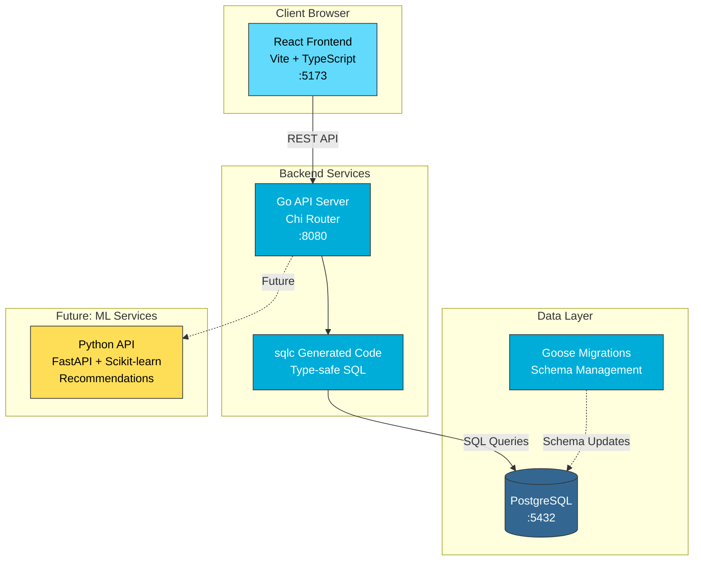

# devradar

  
   
  Track and present your skills as developer.
  Actively manage team competencies as leader.

## 🏗️ Architecture

```mermaid
graph TB
  subgraph "Client Browser"
      FE[React Frontend<br/>Vite + TypeScript<br/>:5173]
  end

  subgraph "Backend Services"
      API[Go API Server<br/>Chi Router<br/>:8080]
      SQLC[sqlc Generated Code<br/>Type-safe SQL]
  end

  subgraph "Data Layer"
      DB[(PostgreSQL<br/>:5432)]
      MIG[Goose Migrations<br/>Schema Management]
  end

  subgraph "Future: ML Services"
      ML[Python API<br/>FastAPI + Scikit-learn<br/>Recommendations]
  end

  FE -->|REST API| API
  API --> SQLC
  SQLC -->|SQL Queries| DB
  MIG -.->|Schema Updates| DB
  API -.->|Future| ML

  style FE fill:#61dafb,stroke:#333,color:#000
  style API fill:#00add8,stroke:#333,color:#fff
  style DB fill:#336791,stroke:#333,color:#fff
  style ML fill:#ffde57,stroke:#333,color:#000
  style SQLC fill:#00add8,stroke:#333,color:#fff
  style MIG fill:#00add8,stroke:#333,color:#fff
```

## 🚀 Tech Stack

### Frontend (`/web`)

- **Framework:** React + TypeScript (Vite)
- **State:** TanStack Query (Server State) + Zustand (UI State)
- **Styling:** Tailwind CSS + Shadcn UI
- **Routing:** React Router
- **Visuals:** Recharts

### Backend (`/backend`)

- **Language:** Go
- **Router:** Chi
- **Database Access:** sqlc (Type-safe SQL generation)
- **Database:** PostgreSQL
- **Auth:** OAuth2 (GitHub/Google) with HttpOnly Sessions

### Recommendation Engine _[Planned]_

- Python (FastAPI + Scikit-learn)

## 🎯 Project Goals

1.  **Skill Journal:** A "diary" view for users to log daily activities and link them to specific skills.
2.  **Visual Analytics:** Graphical dashboards to visualize competence growth over time.
3.  **Smart Recommendations:** A system that suggests new skills or activities based on the user's history and similar users' data.

## 🛠️ Development Setup

This project uses **VS Code Dev Containers** to ensure a consistent environment. You do not need to install Go, Node.js, or Postgres locally on your machine—only Docker.

### Prerequisites

- [Docker Desktop](https://www.docker.com/products/docker-desktop/) (Running)
- [VS Code](https://code.visualstudio.com/)
- [Remote - Containers Extension](https://marketplace.visualstudio.com/items?itemName=ms-vscode-remote.remote-containers)

### Quick Start

1.  **Clone the repo:**

2.  **Open in Container:**

3.  **Wait for Initialization:**

4.  **Use Task to do what you want**

We use [Task](https://taskfile.dev/) to automate development.

| Command                   | Description                                                       |
| :------------------------ | :---------------------------------------------------------------- |
| `task setup`              | Installs Go modules and NPM packages. Run this first.             |
| `task dev`                | Starts the **Go Backend** (:8080) and **React Frontend** (:5173). |
| `task db:create name=foo` | Creates a new SQL migration file in `backend/db/migrations`.      |
| `task db:up`              | Applies pending migrations to the database.                       |
| `task generate`           | Runs `sqlc` to update Go structs based on SQL queries.            |
| `task db:reset`           | **Destructive:** Wipes the DB and re-runs all migrations.         |

### Typical Workflow

1. **New Feature:** `task db:create name=add_comments`
2. **Edit SQL:** Write your SQL in the new file.
3. **Apply:** `task db:up` (This automatically runs `task generate` too!)
4. **Code:** `task dev` and start using the new generated structs in Go.

5. **Access the App:**
   - Frontend: [http://localhost:5173](http://localhost:5173)
   - Backend API: [http://localhost:8080](http://localhost:8080)
   - Database: `localhost:5432` (User: `postgres`, Pass: `postgres`, DB: `postgres`)

## 🗺️ Roadmap & Step Plan

We follow the "Tracer Bullet" methodology: building thin, complete slices of functionality rather than isolated layers.

### Phase 1: The Foundation (Tracer Bullet)

- [x] Set up Monorepo structure (Go + Vite).
- [x] Configure Dev Container with Postgres.
- [x] **Goal:** A `/api/users` endpoint that queries the DB and is displayed on the React frontend.

### Phase 2: The Diary Core

- [ ] Design DB Schema (`users`, `skills`, `activities`).
- [ ] Generate Go code with `sqlc`.
- [ ] Build "Add Activity" form (React Hook Form + Zod).
- [ ] Build "Activity Feed" (Infinite Scroll with React Query).

### Phase 3: Auth & Infrastructure

- [ ] Implement GitHub OAuth flow (Backend-for-Frontend pattern).
- [ ] Secure cookies (HttpOnly, SameSite).
- [ ] Deploy "Skeleton" to Production (Railway + Vercel) to verify cross-domain cookies.

### Phase 4: Visualization & Intelligence

- [ ] Create Aggregation Queries in SQL (Competence over time).
- [ ] Implement Charts using Recharts.
- [ ] Spin up Python Microservice (FastAPI).
- [ ] Implement basic recommendation algorithm.

## ☁️ Deployment Setup

We use a split-stack deployment strategy for cost and performance optimization.

### Architecture

| Component    | Provider              | Reason                                                                     |
| :----------- | :-------------------- | :------------------------------------------------------------------------- |
| **Frontend** | **Vercel**            | Global CDN, optimized for Vite/React static assets.                        |
| **Backend**  | **Railway**           | Easy Docker deployment, runs close to the DB.                              |
| **Database** | **Railway** (or Neon) | Managed Postgres.                                                          |
| **DNS**      | **Custom Domain**     | Required for shared cookies (e.g., `app.domain.com` and `api.domain.com`). |
